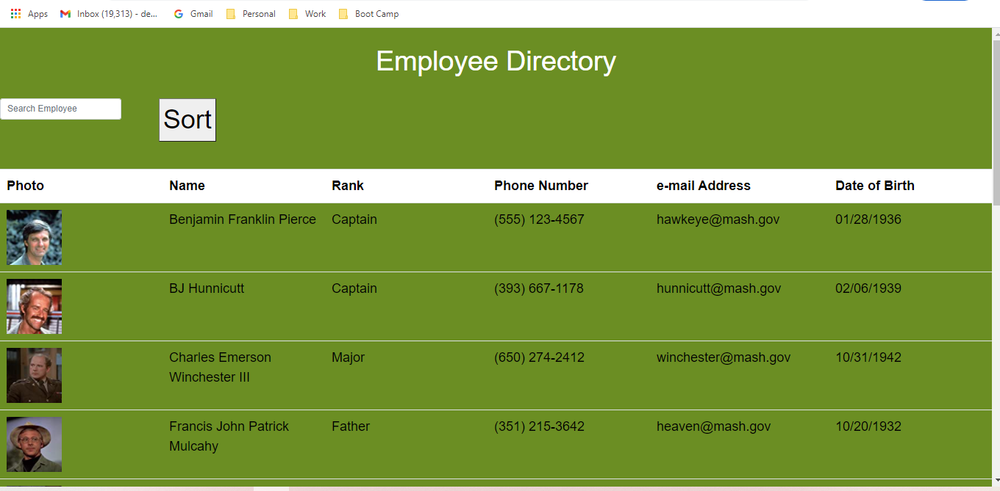
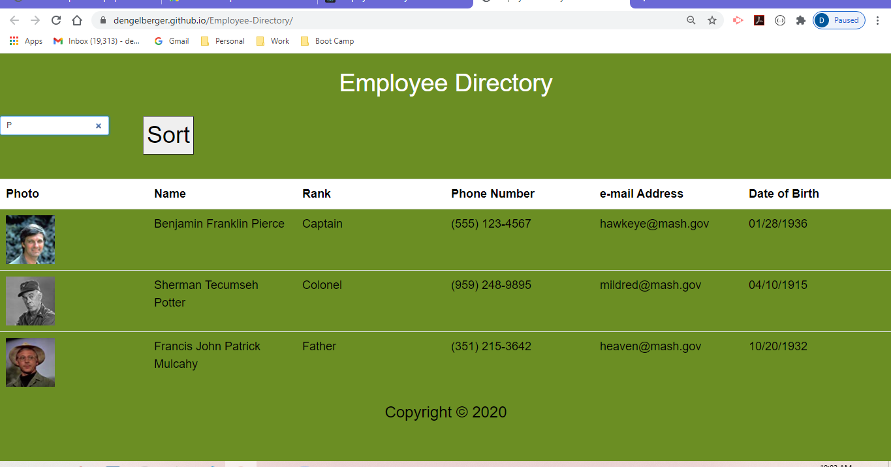
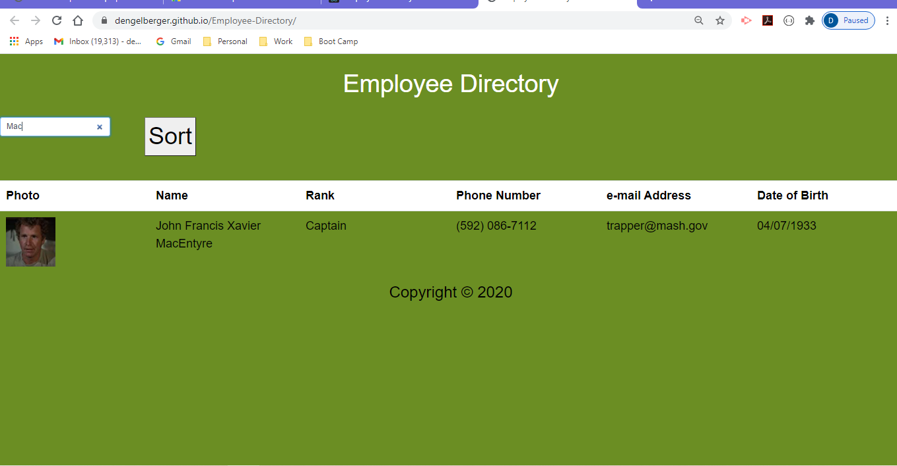
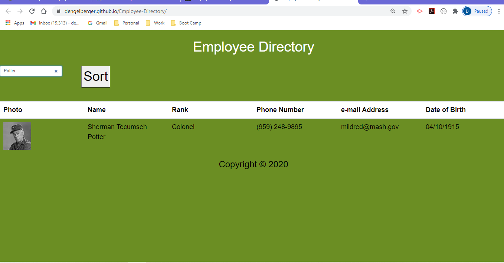
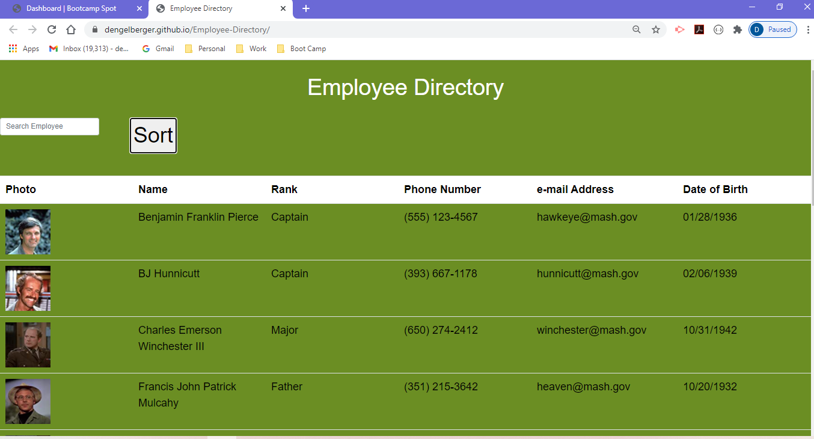
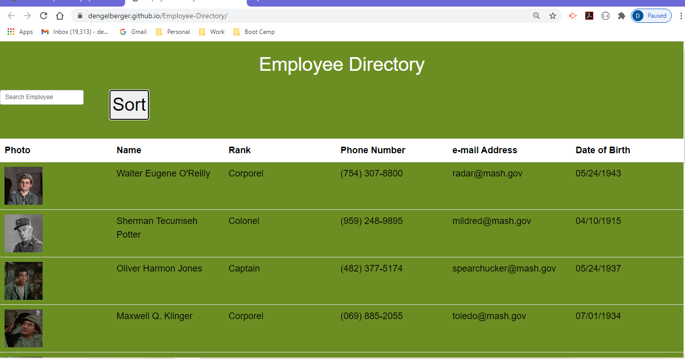

# React Employee Directory

  

  ## Description 
  
  This app was built using React.js.  It involved creating JSX and Components as well as building a json with data to input.  It also has a search and sort function.

  ## Table of Contents

  * [Installation](#installation)
  * [Usage](#usage) 
  * [License](#license)
  * [Contributing](#contributing)
  * [Tests](#tests)
  * [Questions](#questions)
 

  ## Installation 
  
  To build a react app I first had to use npm create-react-app and name the app. Then I had to clean out unnecessary files and build my app.  Finally, this app was deployed using GitHub deploy.

  ## Usage 
  
  This program can be used by anyone who wants to keep a contact list somewhere and be able to search for people in their list of contacts.

  ## License 

  This project is licensed under the MIT license.

  Click here for the MIT license: https://choosealicense.com/licenses/mit/

  ## Contributing 
  
  Thanks to the instructors and fellow classmates for help in completing this application. I used the main characters from the TV show M*A*S*H because it is one of my favorites. Here are some screenshots of the deployed app.

  This is the initial page upon deployment:

  This is what the page looks like as a search is started. This one was just the letter P:

  This is what the page looks like upon searching for MacIntyre:

  This is what the page looks like upon searching for Potter:

  This is what the page looks like on the first click of the Sort button, which returns an ascending sorted list:

  This is what the page looks like on the second click of the Sort button, which returns a descending sorted list:

  ## Tests 
  
  no other testing currently.

  ## Questions 

  Questions or comments about this README.md file? Contact me at dengelberger@gmail.com or visit my GitHub at https://github.com/DEngelberger.

